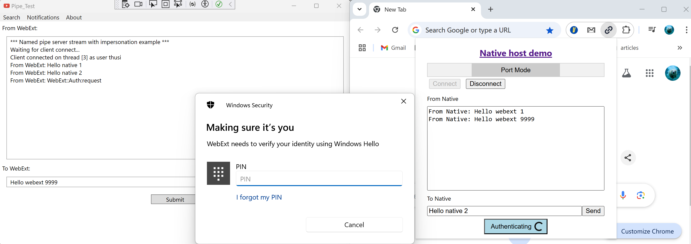
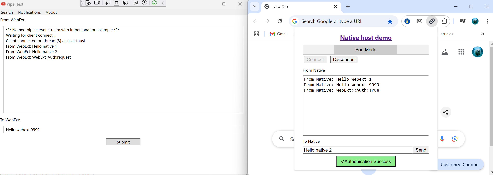

# Introduction
This project demonstrate Chrome/Edge browser extension native messaging to native apps on Windows OS
Mainly contains these sections
* YoutubeAssist visual studio project (YouTubeAssist.sln)
  - YoutubeAssist WPF app, this is the native app
  - ClientHost std IO console app, this is the standard IO app that browser extension can connect to, then this app will use IPC(NamedPipe) to connect to the native app, like a bridge between the native app and browser extension 
* Web app and browser extension (in the Web directory)
  - WebApp, a web server for demo purpose
  - WebExt, the browser extension

# Build

## YouTubeAssist.sln
Open the `YouTubeAssist.sln` in visual studio and build the solution

### YoutubeAssist WPF
This project need windows 11 SDK(10.0.26100.0), which can be installed from visual studio installer -> Individual components

### ClientHost console
This app will use a `post-build.bat` file to write registry key according to this [browser extension nativeMessaging documentation](https://developer.chrome.com/docs/extensions/develop/concepts/native-messaging#native-messaging-host-location)

## Web
* Install Nodejs 20.10.0+
* Install yarn 4.5 according to [installation doc](https://yarnpkg.com/getting-started/install)
* Go to the `Web` directory, run these command
  - `yarn install`
  - `yarn build-ext`
  - `yarn build-app`

The browser extension and web app will be in the `build` folder, then load the extension from chrome://extensions/ developer mode

# Usage
* Build the ClientHost app, YoutubeAssist WPF, WebExtension, and load WebExtension in Chrome/Edge
* Launch the YoutubeAssist WPF
* Open browser extension popup, a port would be created by using `chrome.runtime.connectNative` and connect to the WPF.
  - In windows task manager, a `ClientHost` process will also be created
* Send messages between WPF and browser extension
* Click the `Authenticate by Windows Hello` button on popup, you will be prompted by windows hello challenge

  

  